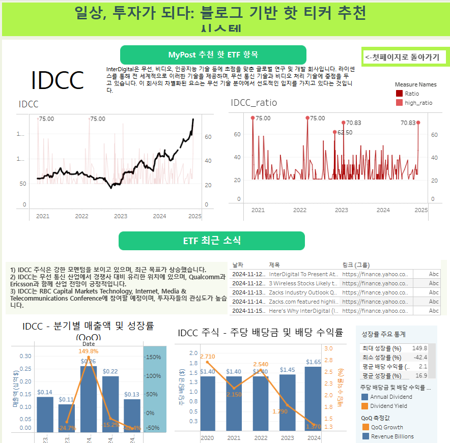

# 개요
작년에 했던 학교프로젝트 중 생각나서 업로드 해볼까 한다
스타벅스는 어떤 전략으로 매장 입지를 선택할까?  
이런 궁금증이 들었다. (사실은 친구가 아이디어를 줘서 해보기로 했다.)

그래서 두 가지 가설을 세웠다:

- **가설 1:** 동네 인구가 많은 지역에 스타벅스 매장이 많을 것이다.
- **가설 2:** 직장인이 많은 지역에 스타벅스 매장이 집중되어 있을 것이다.

이 가설들을 검증하기 위해 데이터를 수집해보자.

# 데이터 수집
## 크롤링을 해보자!

일단 크롤링을 하려면, 해당 웹사이트를 찾아야 한다.

- [스타벅스 매장 찾기](https://www.starbucks.co.kr/store/store_map.do)

스타벅스 홈페이지에서 매장을 찾을 수 있는 좋은 페이지를 발견했다! (스벅 홈페이지 - 매장 찾기 - 지역 검색)

이제 본격적으로 데이터를 수집해보자.


1. 우선, 스타벅스 매장을 찾기 위해 Selenium을 사용해 스타벅스 매장 검색 페이지에 접속합니다.

```python
import time
import pandas as pd
import requests
from bs4 import BeautifulSoup
from selenium import webdriver
from selenium.webdriver.common.by import By
from selenium.webdriver.chrome.service import Service

# Selenium 설정
service = Service()
options = webdriver.ChromeOptions()
driver = webdriver.Chrome(service=service, options=options)

# 스타벅스 매장 검색 페이지로 이동
url = 'https://www.starbucks.co.kr/store/store_map.do?disp=locale'
driver.get(url)

```


이렇게 하면 크롬이 자동으로 열리면서 데이터를 수집할 준비가 됩니다.


2. 이제 서울에 있는 매장만 특정해서 데이터를 수집하기 위해, '서울' 버튼을 찾아 클릭해보겠습니다.

```python
from selenium.webdriver.common.by import By
from selenium.webdriver.support.ui import WebDriverWait
from selenium.webdriver.support import expected_conditions as EC

# '서울' 버튼의 CSS 선택자
seoul_btn = '#container > div > form > fieldset > div > section > article.find_store_cont > article > article:nth-child(4) > div.loca_step1 > div.loca_step1_cont > ul > li:nth-child(1) > a'

try:
    # CSS_SELECTOR가 seoul_btn를 20초 내에 클릭 가능할 때 클릭
    WebDriverWait(driver, 20).until(EC.element_to_be_clickable((By.CSS_SELECTOR, seoul_btn))).click()
except TimeoutError:  # TimeoutException 발생 시 예외 처리
    print("해당 페이지가 20초 내에 열리지 않았음")

```
'서울'을 클릭하면 서울에 있는 스타벅스 매장 리스트로 이동하게 됩니다. 이제 매장 리스트를 수집하는 단계로 넘어갈 차례입니다.


3. 
```python
# '전체' 버튼 요소를 찾아 클릭
all_btn = '#mCSB_2_container > ul > li:nth-child(1) > a'
WebDriverWait(driver, 20).until(EC.element_to_be_clickable((By.CSS_SELECTOR, all_btn))).click()

# BeautifulSoup으로 HTML 파서 만들기
html = driver.page_source
soup = BeautifulSoup(html, 'html.parser')
starbucks_soup_list = soup.select('li.quickResultLstCon')

# 스타벅스 매장 정보 샘플 확인
startbucks_store = starbucks_soup_list[0]
name = startbucks_store.select('strong')[0].text.strip()
lat = startbucks_store['data-lat'].strip()
lng = startbucks_store['data-long'].strip()
# store_type = startbucks_store.select('i.pin_general')[0]
store_type = startbucks_store.select('i')[0]['class'][0]
add_tel = str(startbucks_store.select('p.result_details')[0]).split('<br/>')
address = add_tel[0].split('>')[1]
tel = add_tel[1].split('<')[0]

print(name)         # 매장명
print(lat)          # 위도
print(lng)          # 경도
print(store_type)   # 매장 타입
print(address)     # 주소
print(tel)          # 전화번호


```

**매장명:** 역삼아레나빌딩  
**위도:** 37.501087  
**경도:** 127.043069  
**매장 타입:** pin_general  
**주소:** 서울특별시 강남구 언주로 425 (역삼동)  
**전화번호:** 1522-3232


제대로 수집이 된것으로 보입니다! 


4. 데이터 수집 확인 

결과가 제대로 수집된 것으로 보입니다! 이제 수집한 데이터를 확인해볼 차례입니다.

starbucks_list 변수에 수집된 데이터를 저장해두었으니, 이를 확인해보면 잘 수집되었는지 확인할 수 있습니다.


```python

starbucks_list
```


4. 데이터프레임으로 변환

수집한 스타벅스 매장 데이터를 pandas 데이터프레임으로 변환하여 더 쉽게 분석할 수 있습니다. 아래 코드에서 starbucks_list에 담긴 데이터를 데이터프레임으로 변환해줍니다.

```python
# pandas의 데이터프레임 생성
columns = ['매장명','위도','경도','매장타입', '주소','전화번호']
seoul_starbucks_df = pd.DataFrame(starbucks_list, columns = columns)
seoul_starbucks_df.head()
```

이 코드를 실행하면 수집된 스타벅스 매장의 정보가 데이터프레임 형식으로 깔끔하게 정리되어 출력됩니다.
