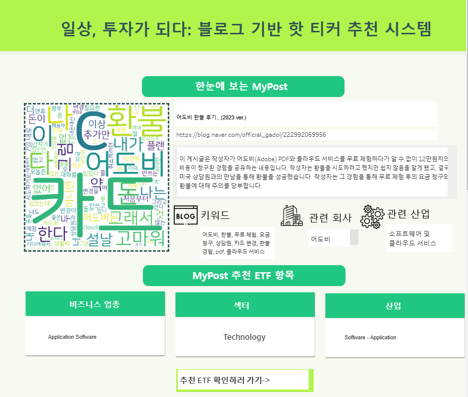

일단 결과부터...

## 입선!! 

이라는 첫 대회 퀘거를 이뤘다.

# 대회 준비 과정

# 프로젝트 내용

## 🌟 서비스 개요

이 서비스는 사용자가 블로그에 작성한 내용을 분석해 관심사와 연관된 미국 ETF를 추천해주는 시스템입니다.  
주식에 대한 지식이 부족하더라도, 관심 있는 분야와 맞는 투자 기회를 자연스럽게 발견할 수 있도록 설계되었습니다.

### 🔑 핵심 기능

- **📊 투자 정보 큐레이션**  
  사용자의 블로그 내용을 분석해 개인에게 딱 맞는 ETF를 추천합니다.

- **🌐 다양한 소스 활용**  
  블로그뿐만 아니라 뉴스, 소셜 미디어 등 다양한 데이터 소스를 통해 투자 기회를 제공합니다.

- **⏱️ 실시간 정보 제공**  
  크롬 확장 프로그램을 활용해 웹 탐색 중에도 실시간으로 맞춤형 투자 정보를 받을 수 있습니다.

- **🤝 플랫폼 협력**  
  네이버 블로그와 같은 인기 플랫폼과 연계해 더 많은 사용자가 쉽게 접근할 수 있습니다.

### 🏁 결론

이 서비스는 블로그 기반으로 맞춤형 ETF를 추천하며, 사용자가 일상 속에서 자연스럽게 투자 기회를 발견할 수 있는 환경을 제공합니다.

# 🌟 블로그 기반 핫 티커 추천 시스템

이 프로젝트는 블로그 콘텐츠를 기반으로 사용자의 관심사를 분석하고, 관련된 ETF를 추천해주는 시스템입니다.  
주식이나 ETF에 대한 전문적인 지식이 없어도 사용자의 블로그 활동과 관심사를 바탕으로 적합한 투자 기회를 제안합니다.

---

## 📋 첫 페이지 구성 설명

### 대시보드 화면 

### 1. **시스템 이름 및 컨셉**
- **제목:** "일상, 투자가 되다: 블로그 기반 핫 티커 추천 시스템"  
- 블로그 데이터를 활용하여 개인화된 투자 정보를 제공합니다.

### 2. **핵심 시각 요소**
- **워드 클라우드:** 사용자가 작성한 블로그에서 추출된 주요 키워드들을 시각적으로 강조하여 한눈에 확인할 수 있도록 구성.
- **MyPost 정보:** 사용자의 블로그 링크와 작성 내용 요약을 제공, 해당 게시글의 맥락을 파악할 수 있도록 돕습니다.

### 3. **추천 결과 제공**
- **키워드:** 블로그에서 추출된 주요 키워드들을 나열.
- **관련 회사 및 산업:** 분석 결과를 바탕으로 사용자의 관심사와 관련된 회사와 산업을 매칭.
- **추천 ETF 항목:**  
  - 비즈니스 업종  
  - 섹터  
  - 산업  
  사용자 관심사에 맞춘 ETF 정보를 간단히 요약하여 표시.

### 4. **추천 ETF 확인 버튼**
- 사용자가 더 많은 정보를 확인할 수 있도록 **"추천 ETF 확인하러 가기"** 버튼을 제공.  
  클릭 시 상세 정보 페이지로 이동하도록 설계(현재 페이지 이동이 구현되지 않은 상태).

---

## 🛠️ 활용 시나리오
- 사용자는 자신의 블로그 콘텐츠를 기반으로 관심 있는 분야의 최신 트렌드 및 ETF 정보를 실시간으로 확인할 수 있습니다.
- **초보 투자자**들도 관심 있는 분야를 통해 간접적으로 투자 기회를 탐색할 수 있습니다.
- 키워드, 관련 회사, 산업, ETF 정보를 직관적으로 확인하며, 투자 의사 결정을 내리는 데 도움을 줍니다.

---

### 💡 이 페이지의 목적
- 사용자 블로그 데이터를 통해 투자와 관심사를 연결하는 과정을 직관적이고 간단하게 설명.
- 워드 클라우드 및 시각적 요소를 활용해 사용자 관심사를 한눈에 파악할 수 있도록 제공.
- 사용자와 투자 기회 간의 연결을 통해, 쉽게 투자를 시작할 수 있는 환경을 조성.

# 📊 블로그 기반 핫 티커 추천 시스템 - 상세 페이지

이 페이지는 사용자가 관심을 가질 만한 **추천 ETF 상세 정보**를 제공합니다.  
주요 ETF 데이터와 함께 관련 지표 및 분석을 한눈에 확인할 수 있도록 구성되었습니다.

---

## 📌 페이지 구성 설명

### 두번째 페이지 화면

### 1. **ETF 이름 및 개요**
- **ETF 이름(IDCC):** 사용자가 추천받은 ETF의 이름과 간단한 소개를 제공합니다.
- **ETF 설명:** IDCC는 무선 통신, 인공지능 기술 등의 주요 트렌드를 연구 및 개발하는 글로벌 기업입니다.  
  관련된 시장 트렌드와 기술적 포지션을 한눈에 확인할 수 있습니다.

---

### 2. **ETF 주요 지표 시각화**
- **IDCC 가격 추이 그래프:**  
  - ETF의 최근 가격 동향을 시각화하여 투자 가능성을 평가할 수 있습니다.  
  - 강한 상승세를 보이는 모멘텀을 파악할 수 있습니다.
- **IDCC_Ratio 그래프:**  
  - 주요 비율 데이터(예: P/E Ratio, High Ratio 등)와 해당 변화 추이를 함께 보여줍니다.

---

### 3. **ETF 최근 소식**
- 최신 뉴스 및 이벤트를 테이블 형태로 제공합니다.  
  - 뉴스 제목과 링크를 클릭하여 해당 기사로 바로 이동할 수 있습니다.  
  - **활용 예시:** 
    - 특정 ETF가 참여하는 주요 행사 정보 확인.
    - 관련 산업 동향 및 기업 경쟁력을 분석.

---

### 4. **추가 데이터 분석**
- **분기별 매출액 및 성장률(DQoQ):**  
  - ETF의 기초 자산을 기반으로 매출 성장률을 시각적으로 보여줍니다.  
  - 과거 성장률 데이터와 추세를 비교하며 미래 성장 가능성을 평가.

- **주식 배당금 및 배당률 그래프:**  
  - 배당금 지급 내역과 배당 수익률을 확인할 수 있습니다.  
  - 안정적인 배당 지급 여부와 배당 수익률의 상승/하락 추세를 한눈에 파악.

---

### 5. **요약 및 주요 특징**
- ETF의 **최대 성장률, 성장률 변동성, 배당률** 등 핵심 데이터를 요약하여 제공합니다.  
  - **예시 데이터:** 
    - 최대 성장률: 149.8%  
    - 배당률 변화: 1.65% (2024년 기준)

---

## 🔙 페이지 기능
- **첫 페이지로 돌아가기:** 상단의 버튼을 클릭하여 첫 페이지로 쉽게 이동할 수 있습니다.
- **ETF 데이터 활용:**  
  - 사용자는 추천 ETF의 상세 데이터를 확인하고, 투자를 고려하거나 추가 분석을 진행할 수 있습니다.
